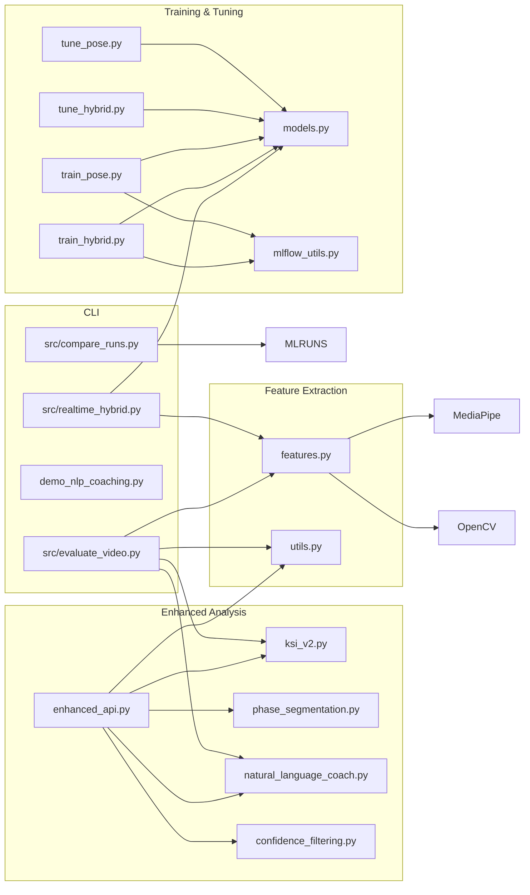

# C4 Component Diagram (Library)

**Method Highlights**
- `ksi_v2.py` (EnhancedKSI / EnhancedKSICalculator): `calculate()`, `calculate_detailed_ksi()`, `calculate_with_confidence()` (bootstrap CIs), feature extraction helpers, DTW with contact-centered windowing.
- `phase_segmentation.py` (PhaseSegmenter): `segment()` (phases + contact frame), `_detect_boundaries()` (velocity thresholds), `_calculate_phase_quality()`, `MultiJointSynchronization.analyze_kinetic_chain()`; convenience `segment_shot()`, `analyze_kinetic_chain()`, `get_phase_feedback()`.
- `natural_language_coach.py` (NaturalLanguageCoach): `generate_feedback()` (severity classification + priority fixes), `format_feedback_text/json()`, helper `_generate_timing_feedback()`, `_generate_power_feedback()`, `_generate_weekly_plan()`; knowledge base spans causal chains, drills, visual cues.
