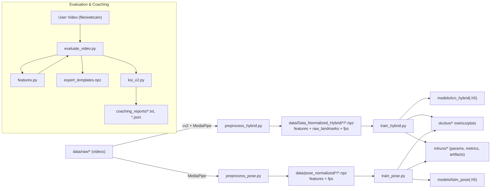

# Data Flow Diagram: Pipelines and Analysis

```mermaid
flowchart LR
  RAW["data/raw/* (videos)"] -->|cv2 + MediaPipe| PREPH[preprocess_hybrid.py]
  RAW -->|MediaPipe| PREPP[preprocess_pose.py]

  PREPH --> HYB["data/Data_Normalized_Hybrid/*/*.npz\nfeatures + raw_landmarks + fps"]
  PREPP --> POSE["data/pose_normalized/*/*.npz\nfeatures + fps"]

  HYB --> TRAINH[train_hybrid.py]
  POSE --> TRAINP[train_pose.py]
  TRAINH --> MODELS["models/tcn_hybrid(.h5)"]
  TRAINP --> MODELS2["models/lstm_pose(.h5)"]
  TRAINH --> DVCLIVE["dvclive/* metrics/plots"]
  TRAINP --> DVCLIVE
  TRAINH --> MLFL["mlruns/* (params, metrics, artifacts)"]
  TRAINP --> MLFL

  subgraph Evaluation & Coaching
    VID["User Video (file/webcam)"] --> EV[evaluate_video.py]
    EV --> FEAT[features.py]
    FEAT --> EV
    EV --> TEMPL[expert_templates.npz]
    EV --> KSI[ksi_v2.py]
    KSI --> REPORTS["coaching_reports/*.txt, *.json"]
  end
```
