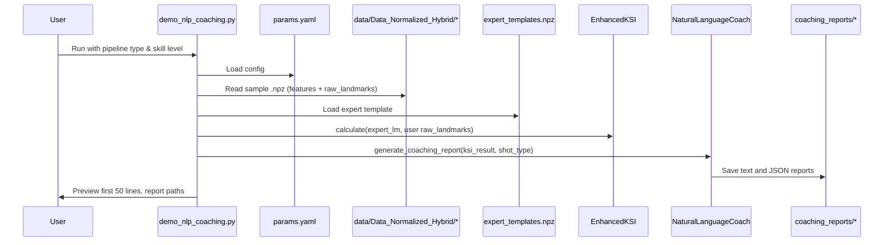

# Sequence: Demo NL Coaching from Data

```mermaid
sequenceDiagram
  participant U as User
  participant D as demo_nlp_coaching.py
  participant P as params.yaml
  participant Data as data/Data_Normalized_Hybrid/*
  participant T as expert_templates.npz
  participant K as EnhancedKSI
  participant N as NaturalLanguageCoach
  participant R as coaching_reports/*

  U->>D: Run with pipeline type & skill level
  D->>P: Load config
  D->>Data: Read sample .npz (features + raw_landmarks)
  D->>T: Load expert template
  D->>K: calculate(expert_lm, user raw_landmarks)
  D->>N: generate_coaching_report(ksi_result, shot_type)
  N->>R: Save text and JSON reports
  D->>U: Preview first 50 lines, report paths
```
