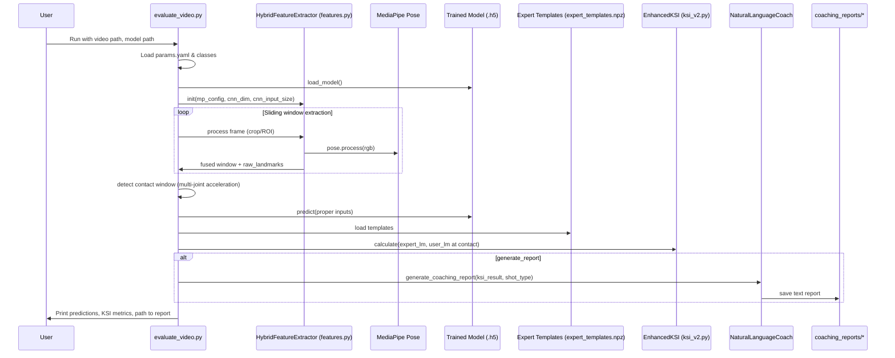

# Sequence: Evaluate Single Video (Hybrid)

```mermaid
sequenceDiagram
  participant U as User
  participant EV as evaluate_video.py
  participant FE as HybridFeatureExtractor (features.py)
  participant MP as MediaPipe Pose
  participant M as Trained Model (.h5)
  participant T as Expert Templates (expert_templates.npz)
  participant K as EnhancedKSI (ksi_v2.py)
  participant N as NaturalLanguageCoach
  participant R as coaching_reports/*

  U->>EV: Run with video path, model path
  EV->>EV: Load params.yaml & classes
  EV->>M: load_model()
  EV->>FE: init(mp_config, cnn_dim, cnn_input_size)
  loop Sliding window extraction
    EV->>FE: process frame (crop/ROI)
    FE->>MP: pose.process(rgb)
    FE->>EV: fused window + raw_landmarks
  end
  EV->>EV: detect contact window (multi-joint acceleration)
  EV->>M: predict(proper inputs)
  EV->>T: load templates
  EV->>K: calculate(expert_lm, user_lm at contact)
  alt generate_report
    EV->>N: generate_coaching_report(ksi_result, shot_type)
    N->>R: save text report
  end
  EV->>U: Print predictions, KSI metrics, path to report
```
