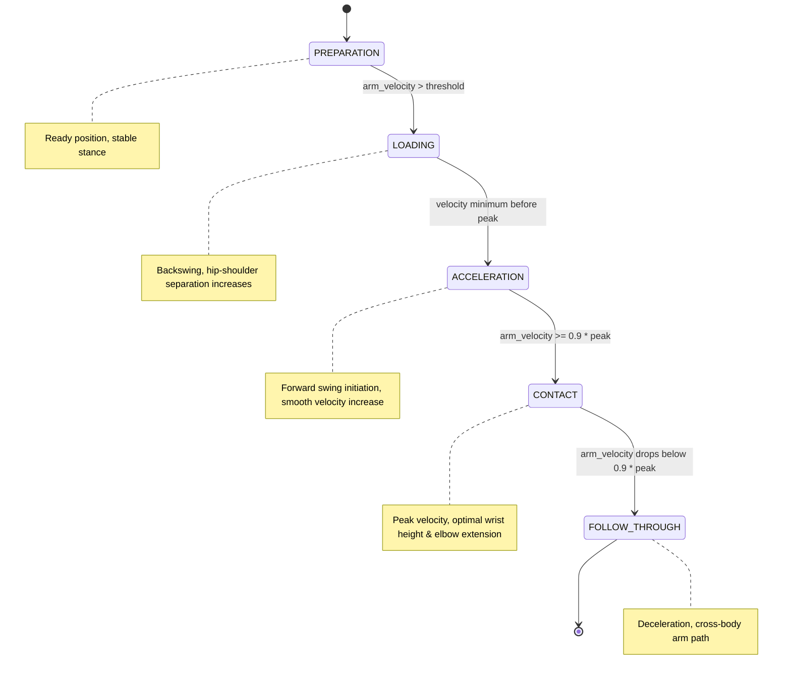

# State Machine: Shot Phase Segmentation

```mermaid
stateDiagram-v2
  [*] --> PREPARATION
  PREPARATION --> LOADING: arm_velocity > threshold
  LOADING --> ACCELERATION: velocity minimum before peak
  ACCELERATION --> CONTACT: arm_velocity >= 0.9 * peak
  CONTACT --> FOLLOW_THROUGH: arm_velocity drops below 0.9 * peak
  FOLLOW_THROUGH --> [*]

  note right of PREPARATION: Ready position, stable stance
  note right of LOADING: Backswing, hip-shoulder separation increases
  note right of ACCELERATION: Forward swing initiation, smooth velocity increase
  note right of CONTACT: Peak velocity, optimal wrist height & elbow extension
  note right of FOLLOW_THROUGH: Deceleration, cross-body arm path
```
